# Docker Lab 1

## Problem 1

1. run hello world
   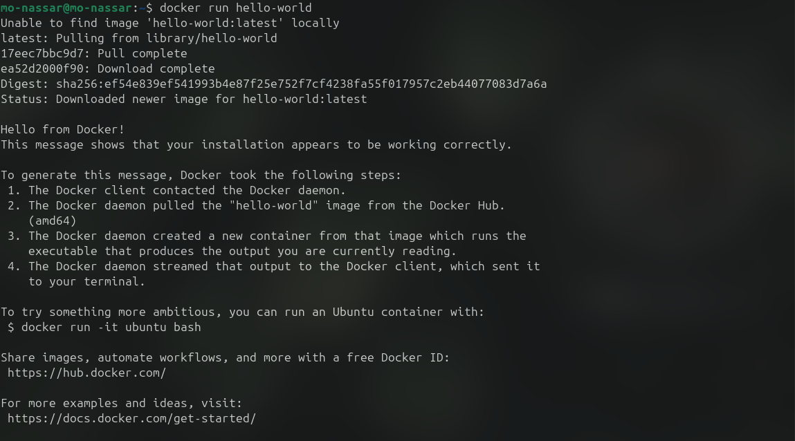
2. check container status
   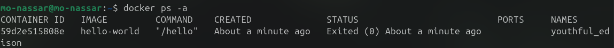
3. start the stopped container
   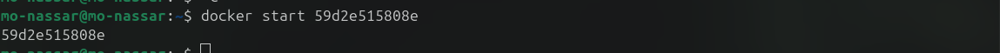
4. remove the container
   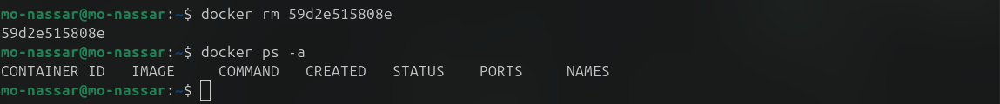
5. remove the image
   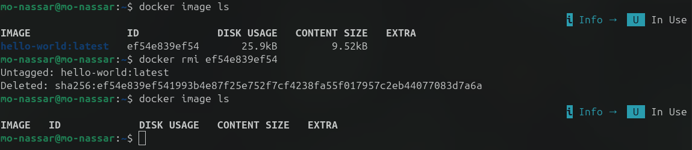

## Problem 2

1. run ubuntu interactively in terminal
   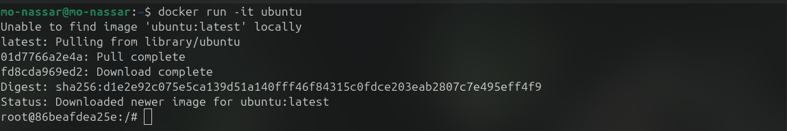
2. run command
   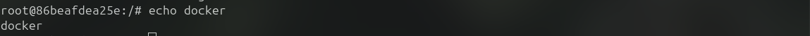
3. create a file
   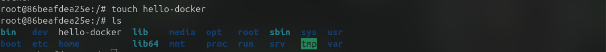
4. stop and remove container
   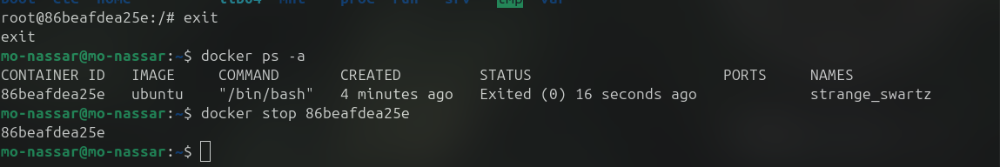
   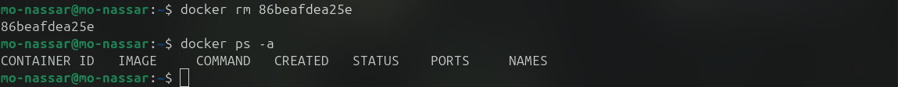
5. remove all stopped containers: already have no containers

## Problem 3

Deploy a MySQL database called app-database Using the mysql latest image in background
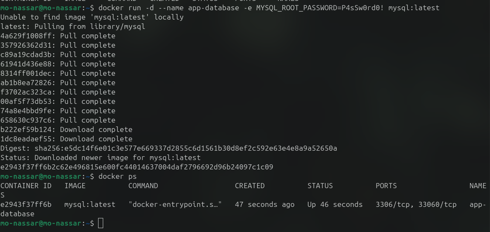

## Problem 4

1. run nginx image
   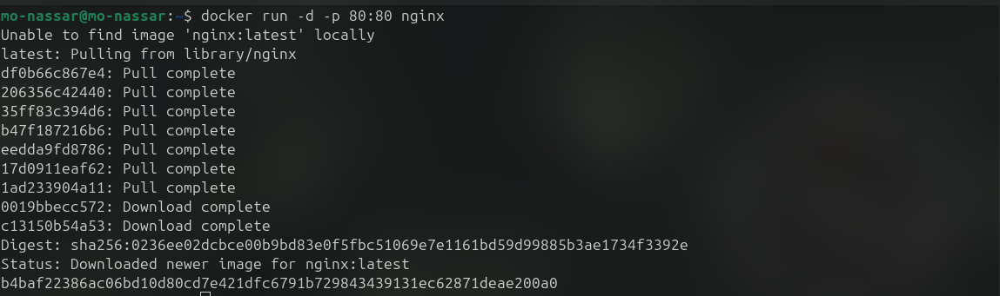
2. add html files
   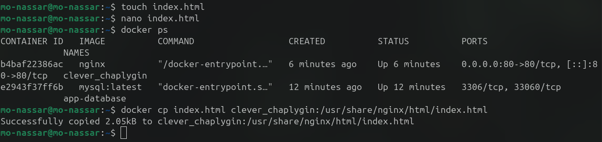
   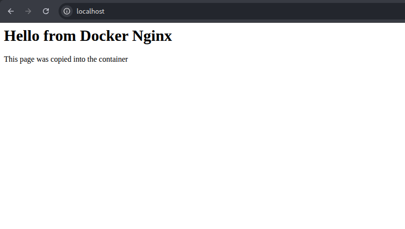
3. create a file
   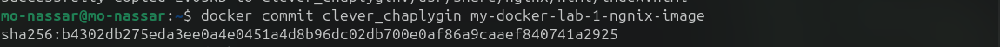
   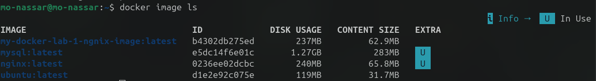

## Problem 5

1. create simple python app
   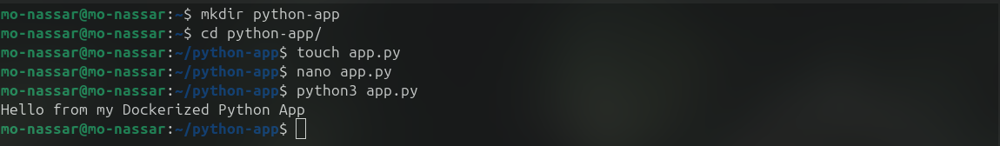
2. create docker file
   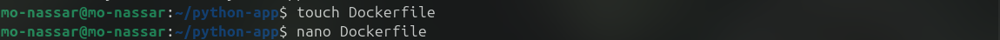
   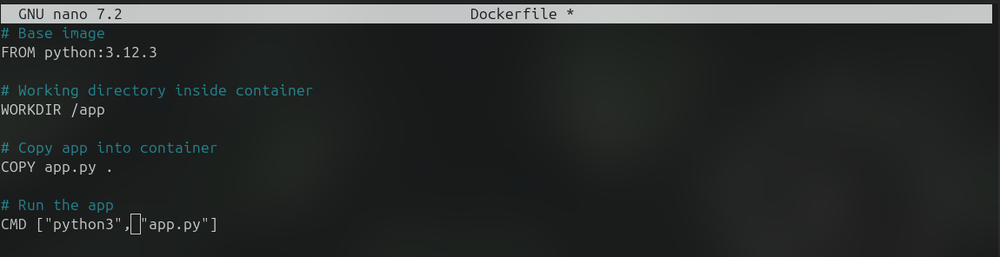
3. build the image and test it
   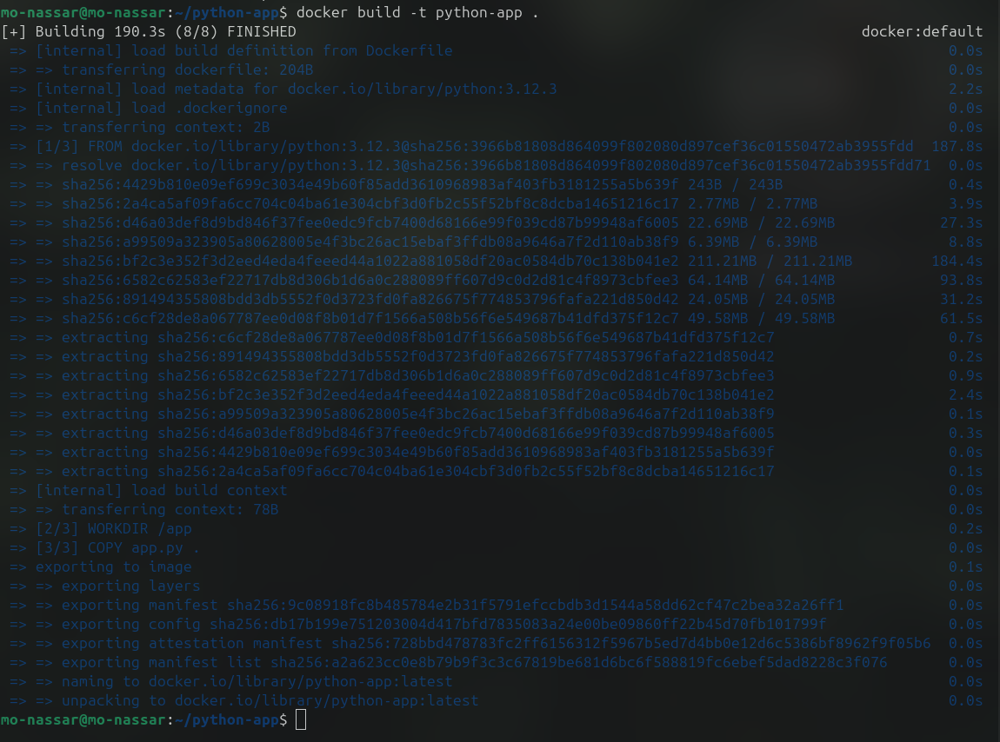
   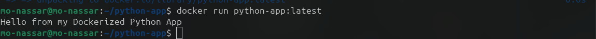
4. exit and stop container
   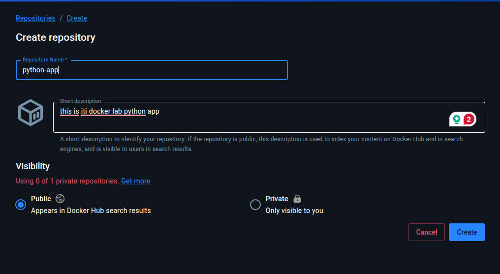
   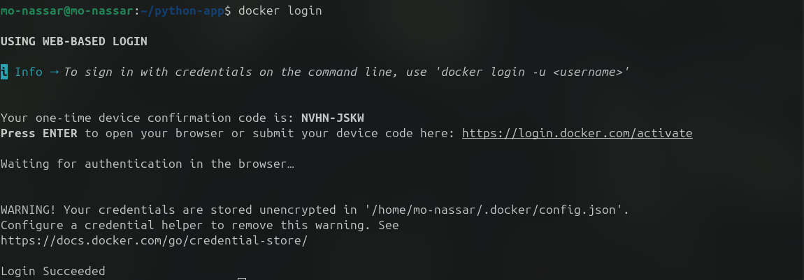
   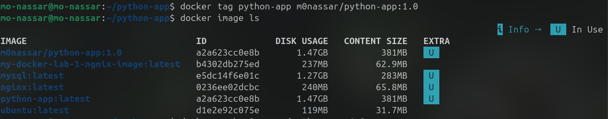
   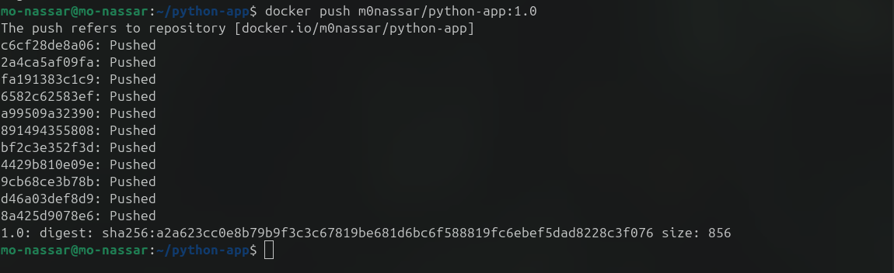
