# Docker Lab 2

## Problem 1

1. create 2 volumes
   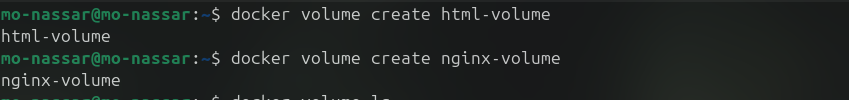
2. run container with volumes
   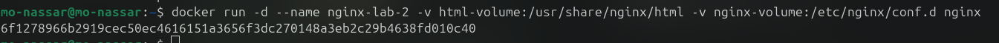
3. edit html content
   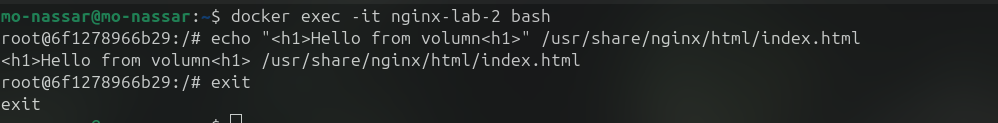
4. remove the container
   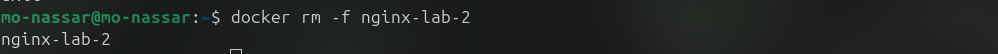
5. create another 2 containers
   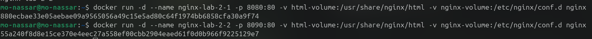
6. access two containers from browser
   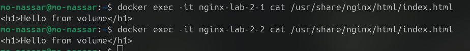
   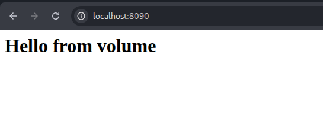

## Problem 2

1. create two volumes
   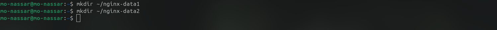
2. bind volumes to container and check
   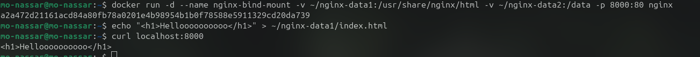
   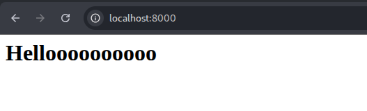
3. remove the container
   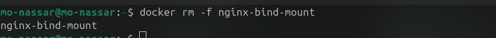
4. create new one to the same volumes
   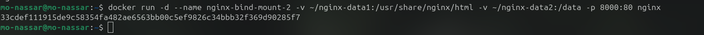
5. check the old content
   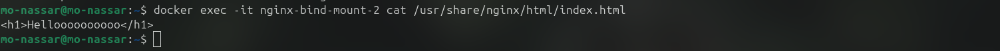
   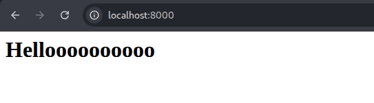
